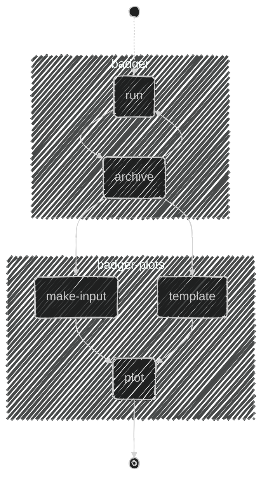

# BADGER: Benchmark Ancient DNA GEnetic Relatedness


---

[](https://doi.org/10.5281/zenodo.15424124) [](https://github.com/MaelLefeuvre/BADGER/actions/workflows/Ubuntu-latest.yml)
## Introduction

`BADGER` (<ins>***B***</ins>enchmark <ins>***A***</ins>ncient <ins>***D***</ins>NA <ins>***GE***</ins>netic <ins>***R***</ins>elatedness) is an automated [`snakemake`](https://snakemake.github.io/) pipeline designed to jointly benchmark the classification performance and accuracy of several previously published ancient DNA genetic relatedness estimation methods. To generate its input test data, `BADGER` leverages both high-definition pedigree simulations, followed by the simulation of raw ancient DNA `.fastq` sequences, through an extensive use of the softwares [ped-sim](https://github.com/williamslab/ped-sim.git) and [gargammel](https://grenaud.github.io/gargammel/), respectively.

<p align="center">

  |  |
  |:-------------------------------------------------------------------:|
  | ***Figure 1***: A summarized diagram view of the `BADGER` workflow  |

</p>

## Installing BADGER

### Minimum system requirements

BADGER is generally designed to operate in high-performance computing environments, and will benefit from as many CPU cores, memory and disk space as possible.  The following specifications are the ***minimum*** system requirements for running BADGER:

- **<ins>Processor</ins>**: 24 CPU-cores
- **<ins>Memory</ins>**: 32GB of RAM
- **<ins>Storage</ins>**: 128GB of available disk space

### Software requirements

BADGER is written using the [`snakemake`](https://snakemake.github.io/) workflow management system and relies extensively on the [`conda`](https://docs.conda.io/projects/conda/en/latest/index.html) environment manager to ensure both interoperability and reproducibility. Hence, a requirement of using BADGER is that users first install `conda` within their system, since the `badger` command line interface in itself is designed to be embedded within a conda environment...

To install [conda](https://docs.conda.io/en/latest/), check the documentation of 
[miniconda3](https://docs.conda.io/en/latest/miniconda.html) and review the detailled 
[installation instructions](https://docs.conda.io/projects/conda/en/latest/user-guide/install/index.html)
beforehand.

On `x86_64-Linux` architectures, a default installation may be achieved using the following commands:
```Bash
MINICONDA_URL="https://repo.anaconda.com/miniconda/Miniconda3-latest-Linux-x86_64.sh"
wget $MINICONDA_URL && bash $(basename $MINICONDA_URL)
```

### 01. Clone this repository 
```bash
git clone --recursive https://github.com/MaelLefeuvre/BADGER.git
cd ./BADGER
```

> [!IMPORTANT]
> Note that all subsequent commands described in this README are executed from the root directory of this repository.

### 02. Install `BADGER` within a dedicated conda environment
#### Simple installation

This command should seamlessly create a dedicated conda environment for BADGER, called `badger-0.4.1`.
```bash
bash ./badger/install.sh
```
This environment should contain the following programs and dependencies:

| software       | version   |
| -------------- | --------- |
| `python`       | `3.11.0`  |
| `R`            | `>=4.1.2` |
| `snakemake`    | `7.20.0`  |
| `badger`       | `>=0.5.1` |
| `badger-plots` | `>=0.5.1` |

### 03. Test the installation

A very basic test suite can be run using the following command, to ensure every program and dependency can be found within the path, as well as running several integration tests.
```bash
./badger/install.sh test
```

#### Manual installation

> [!TIP]
> For users wishing to manually install `BADGER` within a custom environment, a detailled step-by-step procedure may be found here: [manual installation](doc/README.installation.md)

## Configuring BADGER

### Download the required datasets.
Badger will require several datasets in order to run properly, mainly:
- The 1000g-phase3 genotype dataset, version v5b-20130502
- The Allen Ancient DNA Resource *"1240K"* compendium dataset, version v52.2 [(Mallick et al. 2024)](https://doi.org/10.1038/s41597-024-03031-7)
- The GRCh37 Reference genome assembly (release-113)
- The HapMapII genetic recombination map
- The Refined sex-specific genetic map from [(Bhérer et al 2017)](https://doi.org/10.1038/ncomms1499)
- The sex-specific cross-over interference map from [(Campbell et al 2015)](https://doi.org/10.1038/ncomms7260)
 - The supporting dataset and files of TKGWV2 [(Fernandes, et al. 2021)](https://doi.org/10.1038/s41598-021-00581-3)

#### Automated download of datasets

Here, BADGER is bundled with a workflow specifically tailored to download these datasets and place them in their correct locations for future runs:
```bash
badger setup
```
This module will:
1. Download and place all the datasets required for future runs in a `./data` directory.
2. Pre-create all the required conda environments for future runs. (Note that these environments are only local to this specific workflow and will be located under the hidden folder `.snakemake/conda`)

> [!WARNING]
> By default, `badger` will run snakemake using half of the available cores and memory. This behaviour can be modified using the `--cores` and `--mem_mb` arguments.

#### Manual download

> [!TIP]
> If you wish to instead manually download some or all of the listed datasets required to run BADGER, detailled download instructions may be found here: [Manual download instructions](doc/README.datasets.md)


### Review and modify BADGER's main config file

The simulation parameters, and general behaviour of BADGER can be configured by modifying the [`config/config.yml`](config/config.yml) configuration file. Note that this file generally follows the [YAML format specifications](https://yaml.org/spec/) and is provided *as-is* to snakemake when running the pipeline.

> [!IMPORTANT]
> An extensive explanation of every keyword may be found here: [config parameters reference](doc/README.badger-config.md). <br><br>
> Note that sensible defaults for all parameters are provided in this file, and BADGER is expected to run smoothly without modifying this file. However, we recommend that users should at least modify the parameters of `gargammel` and `ped-sim` in order to tailor BADGER's benchmarking results to their own use-cases:

**Example gargammel configuration**: 
```yaml
gargammel:
  coverage:                  0.05 # (average sequencing depth (X) [0-Inf])
  comp-endo:                 0.98 # (proportion of endogenous sequences [0-1])
  comp-cont:                 0.02 # (proportion of human contaminant sequences [0-1])
  comp-bact:                 0.05 # (proportion of bacterial contamination)
  pmd-model:                 "briggs"  # See (Briggs et al 2007)
  briggs:
    nick-frequency:          0.024   # Per-base nick frequency rate (nu)
    overhang-length:         0.36    # Single-stranded overhang rate (lambda)
    ds-deaminations:         0.0097  # Double-stranded DNA deamination rate (delta)
    ss-deaminations:         0.68    # Single-stranded DNA deamination (delta_ss)
```

For a more advanced use, the documentation of `gargammel-1.1.4` may be found here: [gargammel: simulations of ancient DNA datasets](https://github.com/grenaud/gargammel/blob/b4b151e3682b5d8de298e025b827942f0d4f0b51/README.md)

**Example ped-sim configuration**
```yaml
ped-sim:
  replicates:    1  # Number of pedigree replicates for this run.
  data:
    codes:       "resources/ped-sim/ped-definition/outbred/pedigree_codes.txt"
    definition:  "resources/ped-sim/ped-definition/outbred/pedigree.def"
  params:
    pop:         "TSI" # 1000g-phase3 (super-)population code
```

Here, the files provided in `data['codes']` and `data['definition']` should provide with a good starting point to start benchmarking the available kinship estimation methods up to the third degree. Advanced configurations of BADGER for specific use-cases might however require to design custom files. When such is the case, detailled explanations on the format and purpose of these files may be found by following the link here:i [advanced-ped-sim-configuration](doc/README.ped-sim-config.md)

## Running BADGER
### Basic workflow
The basic workflow of BADGER is divided into several steps, each with their dedicated command line program and module:




1. Run and archive multiple benchmark replicates using the `badger` helper command line program
   - Running a benchmark replicate is mainly done by the `badger run` module
   - As the uncompressed output of BADGER may use up a lot of disk space, the `badger archive` module should be applied to efficiently store results in a dedicated directory.
   - As running hundreds of benchmark replicates in parallel using whole genome sequences can be computationally intensive, we recommend the use of `badger loop-pipeline`, to subdivide the replicates into more manageable chunks. These chunks can act as data checkpoints and will be  automatically archived by the software.
2. Plot and summarize the benchmarking results using `badger-plots`. Plotting these results will require the use of two yaml files:
   - A first yaml is in charge of detailling which archived results should be used for plotting. This file can be easily generated using the `badger-plots make-input` module.
   - A second yaml file is in charge of providing with plotting parameters. A preconfigured template for this parameter file can be obtained by querying the `badger-plots template` module.
   - Plotting can then be achieved using `badger-plots plot`, once in possession of these two yaml files.

---

### Quick start

> [!NOTE]
> This quick start example assumes you have correctly installed and setup BADGER, and that its corresponding conda environment has been activated. See the dedicated corresponding sections [Installing BADGER](#installing-badger) and [Configuring BADGER](#configuring-badger) if you have not already done so.


#### 01. Starting a single BADGER run of simulations.

Once properly configured, running a single run of BADGER can be executed using the following command

```bash
badger run --cores 32 --mem-mb 64000 --verbose
```

This example will start the snakemake pipeline, with sensible defaults, while requesting 32 cores and 64 gigabytes of memory as computational resources, and using the parameters specified in `config/config.yml`.

Once completed, all generated results should be contained within a `./results` directory at the root of BADGER's repository.


#### 02. Archiving a single simulation run of BADGER

Once an iteration of `badger run` has been completed, the simulation results may be stored and archived in a compressed form, in a separate directory. The directory may be specified by providing a valid path in the `config/config.yml` file

```txt
archive:
  archive-dir: "/path/to/an/archive/folder"
  compress-level: 9
```

```bash
badger archive
```

This command will generate a subdirectory within the specified archive directory, called `run-<runid>`, and copy the final results of the previous BADGER run in an archived form. Note that BADGER does not use any proprietary compression format, and only uses `.cram`, `.xz` and `.tar.gz` formats to compress these results, and all of the resulting files may still be manually reviewed using [`tar`](https://linux.die.net/man/1/tar), [`xz`](https://linux.die.net/man/1/xz) and [`samtools split`](http://www.htslib.org/doc/samtools-split.html). Here, BADGER provides with a dedicated module to conveniently decompress these archived results. See the dedicated chapter [Unpacking archived runs](#unpacking-archived-runs)

<details><summary>Click here for a detailled summary of the structure of a BADGER archive:</summary>

```bash
archive/
├── archive-metadata.yml           # Global list of md5 checksum for every archived file
├── run-000/                       # Archived results of a first BADGER run
│   ├── config                     # Stored config/config.yml file.
│   └── results                    
│       ├── 01-gargammel
│       │   └── contaminants       # 1000g sample id of contaminating individuals used during this run
│       ├── 02-preprocess
│       │   ├── 05-dedup           # Per-pedigree processed binary alignment files (.cram format)
│       │   └── 06-mapdamage
│       ├── 03-variant-calling
│       │   └── 00-panel           # SNP positions targeted during this run (.bed.xz format)
│       ├── 04-kinship             # Per-pedigree kinship estimation results of each method for this run
│       │   ├── correctKi
│       │   ├── GRUPS
│       │   ├── KIN
│       │   ├── READ
│       │   ├── READv2
│       │   └── TKGWV2
│       └── meta                   # Selected seed, and git version hash of the softwares used during this run.
│
└──run-001/                        # Archived results of a second BADGER run ...
   ...
```

</details>

--- 
Note that some of these files (most notably those located under `run-<runid>/results/02-preprocess`) are not needed to estimate classification performance, but may serve as a useful checkpoint to re-apply BADGER from already processed bam files. 

#### 03. Running BADGER in a loop.

As the process of running and archiving hundreds of pedigree simulation replicates in parallel may grow the number of snakemake jobs to unmanageable levels for the available computational resources, the `badger loop-pipeline` can here be used to sequentially run and archive several rounds of BADGER simulations. Hence, the following command...
```bash
badger loop-pipeline --iterations 10 -c 32 -m 48000
```

Is expected to sequentially run the `badger run` and `badger archive` modules for a total of ten loops, by leveraging a total of 32 cores and 48GB of memory during every run, and using the same `config/config.yml` configuration file.

Following this example, and upon the completion of the command, users should thus expect a total of ***10*** archived runs in their specified archive directory:
<details><summary>Click here for a detailled view of the expected directory structure after running the previous command:</summary>

```text
archive/
├── archive-metadata.yml
├── run-000/
│   └── ...
├── run-000/
├── run-000/
├── run-000/
├── run-000/
├── run-000/
├── run-000/
├── run-000/
├── run-000/
└── run-000/
```

</details>

---

### Unpacking archived runs

The `badger unpack` module provides with a set of utilities for users wishing to review previously archived results in a decompressed form. Hence, the following command:

```bash
badger unpack all --archive-dir ./path/to/archive/dir --output-dir ./path/to/output/dir
```

Will target **all** of the files found in the specified BADGER archive directory  (`--archive-dir`), and create a *decompressed* ***copy*** of these files in the specified output directory (`--output-dir`)


Note that specific filetypes may also be requested. Thus the following command:
```bash
badger unpack READ READv2 KIN -a /path/to/archive/dir -o /path/to/output/dir
```

will instead only decompress the kinship estimation results of `READ`, `READv2` and `KIN`. A complete list of all available filetypes and arguments may be obtained by running the help command `badger unpack -h`

### Re-running a previously archived BADGER run.

Users wishing to re-apply a previously archived round of BADGER simulations may do so using the `badger rerun` module. Doing so may be helpful to evaluate the impact of modifying variant calling and/or kinship estimation parameters on classification performance, using a constant dataset.

```bash
badger rerun --input-archive-dir /path/to/input/archive/dir.
```

Will sequentially run `badger unpack`, `badger run` and `badger archive` on the specified `--input-archive-dir`. Note that program will automatically archive the updated results, in the directory specified through the `archive-dir:` keyword, within the usual `config/config.yml`

## Plotting the output of BADGER

Summarizing the output of multiple BADGER runs through statistical analysis and plotting is handled by the `badger-plots` command line program. Using `badger-plots` will generally imply that you have applied BADGER in multiple replicates on several parameter sets, each representing a given biological condition (e.g. applying BADGER on several simulated average sequencing depths, by modifying the value of `gargammel['comp-endo']` in the usual `config/config.yml` file). 

> [!IMPORTANT]
> Note that each simulated biological condition is expected to be stored in a separate archive directory for `badger-plots` to work, as the program generally relies on the assumption that the data was compressed and structured using `badger archive`.

Here, throughout this section, we'll assume that a user had previously generated multiple replicates of BADGER to estimate the impact of single-strand deaminations (range: [0, 30]%), at a set sequencing depth of 0.02X

Here, the user has collected every corresponding set of archives into a single directory, and now wishes to evaluate the classification performance of READv2 and KIN on this parameter space.

<details><summary> An illustration of this use-case can be seen by clicking here</summary>

```bash
badger-archived-runs-ssdeamination-0.02X-TSI/
├── 0percent  # badger loop-pipeline -i 20 -- --config gargammel='{pmd-model: briggs, briggs: {ss-deaminations: 0.0}}'
│   ├── archive-metadata.yml
│   ├── run-000/
│   ├── run-001/
│   ...
│   └── run-020/
├── 10percent  # badger loop-pipeline -i 20 -- --config gargammel='{pmd-model: briggs, briggs: {ss-deaminations: 0.1}}'
│   ├── archive-metadata.yml
│   ...
│   └── run-020/
├── 20percent  # badger loop-pipeline -i 20 -- --config gargammel='{pmd-model: briggs, briggs: {ss-deaminations: 0.2}}'
│   ...
│   └── run-020/
└── 30percent  # badger loop-pipeline -i 20 -- --config gargammel='{pmd-model: briggs, briggs: {ss-deaminations: 0.3}}'
    ...
    └── run-020/
```

</details>

---

`badger-plots` will first require two input yaml files to summarize these simulation results:

1. An `input.yml` file, which directs to the software what data should be used as input to test the methods, as well as how it should be structured.
2. A `params.yml` file, which provides the software with plotting parameters.

### 01. Generating an input definition file for `badger-plots`

A yaml input definition file can be generated using the `badger-plots make-input` module:

```bash
mkdir plots

badger-plots make-input --archive-dir badger-archived-runs-ssdeamination-0.02X-TSI/ --subdirs 0percent,10percent,20percent,30percent --methods READv2,KIN > plots/input.yml
```

- `--archive-dir` should specify a main directory, where all of the desired BADGER archive directories should be located
- `--subdirs` is used to provide with a comma-separated list of biological conditions, each corresponding to a subdirectory found within `--archive-dir`. (Note that this argument can also accept [PCRE](https://www.pcre.org/) regular expressions for pattern matching)
- `--methods` is used to provide with a comma-separated list of kinship estimation methods to test.

The previous command should thus generate a yaml file that follows the following base structure, where each input file is hierarchically linked to a given method and biological condition:

```bash
0percent:
  KIN:
  - badger-archived-runs-ssdeamination-0.02X-TSI/run-000/results/04-kinship/KIN/ped1.tar.xz
  - ...
  READv2:
  - badger-archived-runs-ssdeamination-0.02X-TSI/run-000/results/04-kinship/READV2/ped1.tar.xz
  - ...
2percent:
  KIN: ...
  READv2: ... 
4percent:
  KIN: ...
  READ: ...
6percent:
  KIN: ...
  READ: ...
```

### 02. Creating a template parameter file for `badger-plots`

A template `params.yml` file containing default values for plotting can be generated with the `template` module. Here, the previously generated `input.yml`, and the `pedigree-codes` definition used throughout the simulations can be directly provided: 

```bash
badger-plots template --input plots/input.yml --pedigree-codes resources/ped-sim/ped-definition/outbred/pedigree_codes.txt --output-dir plots > plots/params.yml
```

The resulting `plots/params.yml` file is a simple yaml configuration file containing default plotting parameters. These default values can of course be modified at leisure.

> [!IMPORTANT]
> A detailled summary of every parameter can be found here: [`badger-plot` plotting parameters reference](doc/README.badger-plots.md) <br><br>
> Note that almost all of the provided parameters are provided with sensible defaults. Thus, `input` and `pedigree-codes` are the only two parameters that need to be explicitly set by users.


### 03. Plotting summary statistics 

Once in possession of an `input.yml` and a properly configured `params.yml` file, plotting is simply achieved using the `plot` module:

```bash
badger-plots plot --yaml plots/params.yml --threads 32
```

## Installing and running BADGER with older conda versions
If your workstation is running a version of conda `<4.7.0` and you are unable to update it, the installation process of BADGER may be sluggish, as these older versions of conda are single-threaded and made use of a suboptimal solver. In such cases, we recommend the installation of [`mamba`](https://github.com/mamba-org/mamba) within your base environment. The use of a `CONDA_EXE` environment may then be applied to redirect the conda-frontend to `mamba` when running the installation:

```bash
CONDA_EXE="mamba" ./badger/install.sh
```

When setting up badger, the mamba frontend may also be specified as a snakemake option, like so:
```bash
badger setup -- --conda-frontend mamba
```


## Issues and contributions.

For any questions or issue related to the use of BADGER, please directly submit an issue on the github page of this repository. Suggestions, feature requests or code contributions are also welcome. 
